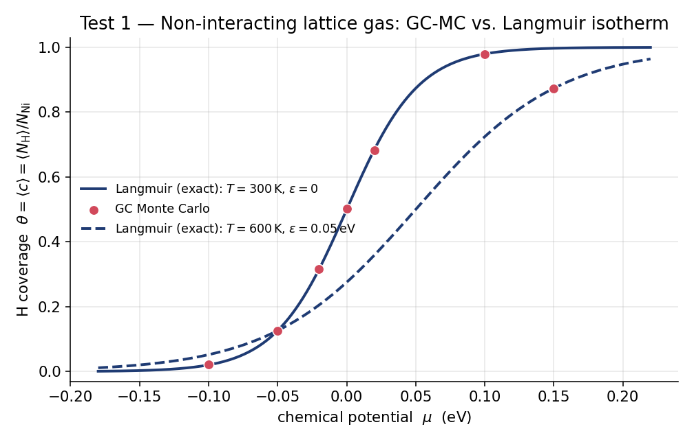

# MC-DRIVER

A site-list **Monte-Carlo driver** for hydrogen on the octahedral interstitial sublattice of
fcc Ni / rock-salt NiH, coupled to **LAMMPS** for energies. It computes the relationship
between the H chemical potential μ\_H and the H concentration *c* = *N*\_H / *N*\_Ni at fixed
temperature, supporting both:

- **Grand-canonical (GC)** sampling at fixed μ\_H (single-phase regions), and
- **Variance-constrained semi-grand-canonical (VC-SGC)** sampling (Sadigh & Erhart *et al.*,
  *Phys. Rev. B* **85**, 184203, 2012) for points inside the α+β miscibility gap.

A Python LAMMPS-library driver is the reference implementation; a native C++ fix is out of
scope unless profiling later justifies it.

**Author:** Erik Bitzek (<e.bitzek@mpi-susmat.de>)
**Implementation and testing:** Claude Code (Anthropic)
**License:** GPL-3.0-or-later

---

## Status

| Component | State |
|:----------|:------|
| Scaffold, structure loading, site list | ✅ done |
| LAMMPS plumbing + round-trip guards | ✅ done |
| GC sampling + statics backend | ✅ done |
| Finite-T NPT backend + blocking | ✅ done |
| VC-SGC + GC-overlap guard | ✅ done |
| Automated test suite | ✅ **24/24 passing** |
| Korbmacher physical anchor (Test 3) | ⏸ pending EAM potential + relaxed structures |

See [`PROGRESS.md`](PROGRESS.md) for detail and [`docs/VALIDATION.md`](docs/VALIDATION.md) for
the full, cross-checkable validation report (theory, plots, numbers, citations).

## Validation at a glance

The driver is verified on a ladder from exactly-solvable to physical: the non-interacting
limit reproduces the analytic **Langmuir isotherm**; small lattices reproduce the **exact
enumeration** of the full *P*(*N*\_H) for GC and VC-SGC; LAMMPS create/delete **round-trips**
to ≤ 1e-9 eV; and an end-to-end GC run *through* LAMMPS reproduces the isotherm.



Regenerate every figure and number with:

```bash
python tools/make_validation_figures.py
```

## Difference from LAMMPS native MD/MC (`fix gcmc`, `fix sgcmc`)

MC-DRIVER samples the **same statistical ensembles** as the native LAMMPS Monte-Carlo fixes,
but it is deliberately **not a drop-in equivalent** — that is the reason it exists. The
cross-check tests (`tests/test_lammps_native_crosscheck.py`, skip-guarded) and
[`docs/VALIDATION.md` §7](docs/VALIDATION.md) cover this in full; the essentials:

**GC vs `fix gcmc`.** `fix gcmc` exchanges atoms with an **ideal-gas reservoir** and inserts
at **random positions in a region** (off-lattice). MC-DRIVER inserts/deletes only on the
octahedral **site list**. Because `fix gcmc` carries the ideal-gas reference (thermal
wavelength Λ, volume V) while MC-DRIVER's lattice-gas acceptance does not, the same physical
state sits at a different numerical chemical potential, offset by a *T*-dependent constant:

> μ_lattice = μ_gcmc + kT · ln( V / (M · Λ³) )

That offset is exactly the calibration constant the SPEC defers to the μ-mapping step. After
aligning the reference they sample the same physics. Speed cuts both ways: the C++ fix is far
faster *per move*, but random-volume insertion accepts very rarely at high H density, where
MC-DRIVER's site-targeted insertion is dramatically more efficient.

**VC-SGC vs `fix sgcmc`.** The native VC-SGC fix (the Sadigh/Erhart vcsgc-lammps package) uses
the same acceptance but a different **move**: it performs **transmutation** (swap atom type
A↔B) at fixed sites and never changes the atom count. MC-DRIVER inserts/deletes H instead. The
two are reconciled by representing each site with an inert placeholder ("ghost") species, so
`insert H ≡ ghost→H` and `delete H ≡ H→ghost`.

**Parallelism — what MC-DRIVER does *not* do.** The native fixes use parallel tricks that
MC-DRIVER does not. `fix sgcmc` implements the *scalable parallel* VC-SGC of Sadigh *et al.*:
spatially decomposed, **simultaneous** trial transmutations across MPI domains (a
sublattice/checkerboard partition keeps concurrent moves from conflicting), with the variance
constraint stabilizing the sampling. `fix gcmc` parallelizes the energy/force evaluation over
LAMMPS's domain decomposition. **MC-DRIVER is a single-process serial reference driver**: one
persistent LAMMPS instance, one move at a time, an unrelaxed `run 0` per flip, and one
relaxation per block. MPI-parallel insert/delete is an explicit non-goal for v1 (SPEC §11) —
the Python driver is meant to be the transparent **correctness oracle** for any future
optimized or parallel implementation, not to compete with it on wall-clock.

## Install

```bash
pip install -e .          # numpy + pyyaml
# the LAMMPS python module is needed only for the LAMMPS-backed tests/runs
```

## Run the tests

```bash
# analytic + enumeration only (no LAMMPS required) — seconds
python -m pytest tests/test_langmuir.py tests/test_enumeration.py tests/test_structure.py -v

# full suite (LAMMPS tests use pair_style zero)
python -m pytest tests/ -v
```

## Run an isotherm

```bash
nih-mc --config config.example.yaml
```

Configuration is a single YAML file (see [`config.example.yaml`](config.example.yaml) and
SPEC §9): potential, structures, ensemble (`gc`|`vcsgc`), backend (`statics`|`md_npt`), `T_K`,
`mu_eV` or `{delta_mu_eV, c0, kappa}`, block counts, and RNG seed. Every run is reproducible
from (seed + config + input structure).

## Repository layout

```
MC-DRIVER/
├── README.md                 ← you are here
├── LICENSE                   ← GPL-3.0
├── CITATION.cff              ← how to cite
├── MC-DRIVER-SPEC.md         ← full implementation spec + acceptance suite
├── PROGRESS.md               ← implementation progress log
├── CLAUDE.md                 ← original Claude Code working instructions
├── config.example.yaml
├── pyproject.toml / requirements.txt
├── src/nih_mc/               ← the package (mc core, backends, structure, cli, outputs)
├── tests/                    ← the 24-test acceptance suite
├── tools/                    ← build_structures.py, make_validation_figures.py
└── docs/                     ← VALIDATION.md, figures/, validation_results.csv
```

## Citing & contributing

If you use MC-DRIVER in academic work, **please cite it** — see [`CITATION.cff`](CITATION.cff)
(and cite the VC-SGC and Korbmacher references therein where relevant).

This software is licensed under the **GNU General Public License v3.0 or later**. You are free
to use, study, modify, and redistribute it; derivative works must remain under the GPL. **If
you improve the code, please report your changes back to the author** (a pull request or an
email to <e.bitzek@mpi-susmat.de>) so they can benefit the wider community.

## References

1. Sadigh, Erhart, *et al.*, *Phys. Rev. B* **85**, 184203 (2012) — VC-SGC ensemble.
   [doi:10.1103/PhysRevB.85.184203](https://doi.org/10.1103/PhysRevB.85.184203)
2. Korbmacher, von Pezold, Brinckmann, Neugebauer, *Metals* **2018**, 8, 280 — Ni-H phase
   equilibria. [doi:10.3390/met8040280](https://doi.org/10.3390/met8040280)
3. Thompson *et al.*, *Comp. Phys. Comm.* **271**, 108171 (2022) — LAMMPS.
