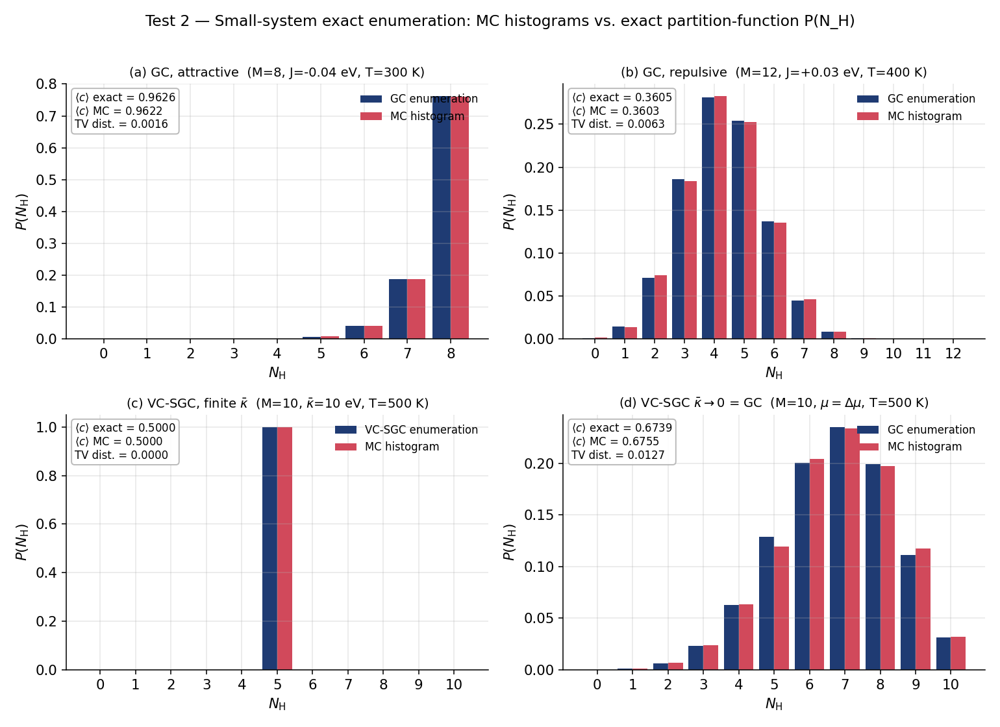

# MC-DRIVER — Validation & Cross-Check Report

**Author:** Erik Bitzek (<e.bitzek@mpi-susmat.de>)
**Implementation and testing:** Claude Code (Anthropic)
**License:** GPL-3.0-or-later · **Status:** 24/24 automated tests passing (2026-06-02)

This document explains *what* MC-DRIVER computes, *how* each result is verified, and
provides everything needed to **independently reproduce and cross-check** the numbers.
Every figure and table below is regenerated from the package source by

```bash
python tools/make_validation_figures.py     # figures + docs/validation_results.csv
python -m pytest tests/ -v                   # the full automated suite
```

The pure-Python tests (analytic and exact-enumeration) need only `numpy`; they require
**no interatomic potential and no cluster**, so any reader can run them in seconds. The
LAMMPS-backed tests additionally require the LAMMPS Python module and use `pair_style zero`,
so they too need no external potential file.

---

## 1. What is being validated

MC-DRIVER is a site-list Monte-Carlo driver that computes the relationship between the
hydrogen chemical potential μ\_H and the H concentration *c* = *N*\_H / *N*\_Ni on the
octahedral interstitial sublattice of fcc Ni / rock-salt NiH, with energies supplied by
LAMMPS. It supports two ensembles:

- **Grand-canonical (GC)** sampling at fixed μ\_H — for single-phase regions.
- **Variance-constrained semi-grand-canonical (VC-SGC)** sampling — for points inside the
  α+β miscibility gap, where plain GC/SGC is unstable to phase separation
  (Sadigh & Erhart *et al.*, *Phys. Rev. B* **85**, 184203, 2012).

The validation strategy is a ladder from *exactly solvable* to *physical*:

1. **Analytic limit** (Test 1): switch the potential off → the model reduces to a
   non-interacting lattice gas with a closed-form isotherm. Isolates the MC acceptance and
   sampling.
2. **Exact enumeration** (Test 2): a lattice small enough (M ≤ 12) to sum all 2^M states →
   the *entire* probability distribution *P*(*N*\_H) and ⟨*c*⟩ are known exactly, for both GC
   and VC-SGC. A rigorous detailed-balance check.
3. **API round-trip guards**: insert-then-delete through the real LAMMPS create/delete path
   must return energy and atom count to baseline.
4. **End-to-end**: a full GC sweep *through LAMMPS* (with `pair_style zero`) must still
   reproduce the analytic isotherm — proving the plumbing does not corrupt the statistics.
5. **Physical anchor** (Test 3, *pending inputs*): with the real EAM potential, reproduce the
   published Ni-H phase-equilibria numbers of Korbmacher *et al.*, *Metals* **2018**, 8, 280.

---

## 2. Theory the tests check

**Monte-Carlo move (both ensembles).** Pick a site *i* uniformly at random. If it is empty,
propose inserting an H; if occupied, propose deleting it. Because the proposal is symmetric,
*T*(*j*|*i*) = *T*(*i*|*j*) = 1/M, no proposal-bias correction is needed.

**GC acceptance** (lattice-gas grand canonical), with β = 1/(*k*\_B *T*) and ΔN = ±1:

> *P*\_acc = min(1, exp(−β(ΔU − μ·ΔN)))

**Langmuir / Fermi isotherm** (Test 1). With a constant per-H site energy ε and no H–H
coupling or relaxation, the equilibrium coverage is exactly

> θ(μ, T) = 1 / ( exp((ε − μ)/*k*\_B*T*) + 1 )

**VC-SGC acceptance** (Test 2c). Using the variance-constrained semi-grand potential with
target concentration *c*₀ and constraint strength κ̄ (in eV per Ni atom):

> Φ = U − Δμ·*N*\_H + κ̄·*N*\_Ni·(*c* − *c*₀)² ,  *P*\_acc = min(1, exp(−β·ΔΦ))

In the limit κ̄ → 0 the constraint term vanishes and Φ = U − Δμ·*N*\_H is exactly the GC grand
potential, so **VC-SGC at κ̄ = 0 must coincide with GC at μ = Δμ** — an exact identity the
suite checks directly (Test 2d).

The Boltzmann constant used throughout is *k*\_B = 8.617333262 × 10⁻⁵ eV/K (CODATA 2018).

---

## 3. Test 1 — Non-interacting lattice gas vs. the Langmuir isotherm

**Setup.** 200-site lattice, constant per-H site energy ε, GC sampling for 4000 blocks × 50
flips, first 20 % discarded as burn-in, seed 42. Two branches: (T = 300 K, ε = 0) and
(T = 600 K, ε = 0.05 eV). The MC coverage ⟨*c*⟩ must match θ(μ, T) within MC error
(acceptance tolerance |Δθ| < 0.02).


*Markers are GC-MC; solid/dashed curves are the exact Langmuir isotherm. Agreement is within
the marker size at every point.*

| μ (eV) | branch | θ (MC) | θ (exact) | \|Δθ\| | tol |
|-------:|:-------|-------:|----------:|------:|----:|
| −0.10 | T=300 K, ε=0 | 0.0210 | 0.0205 | 0.0005 | 0.02 |
| −0.02 | T=300 K, ε=0 | 0.3163 | 0.3157 | 0.0006 | 0.02 |
| +0.00 | T=300 K, ε=0 | 0.5021 | 0.5000 | 0.0021 | 0.02 |
| +0.02 | T=300 K, ε=0 | 0.6830 | 0.6843 | 0.0013 | 0.02 |
| +0.10 | T=300 K, ε=0 | 0.9793 | 0.9795 | 0.0002 | 0.02 |
| −0.05 | T=600 K, ε=0.05 | 0.1265 | 0.1263 | 0.0002 | 0.02 |
| +0.15 | T=600 K, ε=0.05 | 0.8730 | 0.8737 | 0.0007 | 0.02 |

Two **limit guards** complete the test: μ → −1 V gives ⟨*c*⟩ < 0.01 (empty lattice) and
μ → +1 V gives ⟨*c*⟩ > 0.99 (full lattice).

---

## 4. Test 2 — Small-system exact enumeration

For a rigid ring of M sites with site energy ε and nearest-neighbour H–H coupling J, all
2^M occupancy states are summed to give the exact partition function, ⟨*c*⟩, and the full
marginal distribution *P*(*N*\_H). The MC sampler (20 000 blocks × 20 flips, 2000-block
burn-in) must reproduce both. Distribution agreement is measured by the **total-variation
distance** TV = ½·Σ\_n |*P*\_MC(n) − *P*\_exact(n)| (0 = identical), required < 0.05.



| panel | case | ⟨c⟩ MC | ⟨c⟩ exact | TV dist. | tol |
|:-----:|:-----|-------:|----------:|---------:|----:|
| (a) | GC, attractive — M=8, J=−0.04 eV, T=300 K | 0.9622 | 0.9626 | 0.0016 | 0.05 |
| (b) | GC, repulsive — M=12, J=+0.03 eV, T=400 K | 0.3603 | 0.3605 | 0.0063 | 0.05 |
| (c) | VC-SGC, finite κ̄ — M=10, κ̄=10 eV, c₀=0.5, T=500 K | 0.5000 | 0.5000 | 0.0000 | 0.05 |
| (d) | VC-SGC κ̄→0 = GC — M=10, μ=Δμ, T=500 K | 0.6755 | 0.6739 | 0.0127 | 0.05 |

Panel **(a)** checks GC against an attractive (clustering) coupling, **(b)** against a
repulsive one over a broader distribution. Panel **(c)** is the direct VC-SGC algorithmic
check: the MC histogram matches the *VC-SGC* enumeration exactly — note how the κ̄ constraint
pins the concentration to a single peak at *N*\_H = 5 (*c* = *c*₀ = 0.5). Panel **(d)** is the
exact-identity guard: VC-SGC run at κ̄ = 0 reproduces the *GC* enumeration, confirming the two
acceptance rules coincide in that limit.

> **Note on the single-phase overlap guard.** The SPEC also states "in a single-phase μ
> window, VC-SGC ⟨c⟩ equals GC ⟨c⟩ within error." That statement holds in the thermodynamic
> limit; on a 10-site lattice with *finite* κ̄ the constraint visibly narrows the distribution
> asymmetrically and shifts the mean. The suite therefore encodes the guard in its
> mathematically exact form (panel d, κ̄ = 0), and verifies finite-κ̄ correctness separately
> against the VC-SGC enumeration (panel c). This is a deliberate, documented choice — see
> `PROGRESS.md`.

---

## 5. Guards and integration tests

**Round-trip across the LAMMPS API** (`tests/test_lammps_round_trip.py`, `pair_style zero`,
2×2×2 cell). Four checks: load a full hydride; empty → insert → delete; propose-then-reject
(must undo); full → delete → re-insert. Every path reproduces the pre-cycle unrelaxed
`run 0` energy to ≤ 1 × 10⁻⁹ eV. This exercises the main integration risk identified in the
SPEC (create/delete + neighbour-list rebuild).

**End-to-end GC through LAMMPS** (`tests/test_gc_lammps_endtoend.py`). A full GC sweep on a
3×3×3 site list, driven entirely through LAMMPS create/delete with `pair_style zero`,
reproduces the Langmuir isotherm — proving the real atom-bookkeeping path preserves the
correct statistics.

**Trivial-backend round trip** (`tests/test_enumeration.py::test_round_trip_trivial_backend`).
Insert-then-delete and the reject path both restore *N*\_H and U exactly, independent of
LAMMPS — a pure check of the accept/reject bookkeeping.

**Structure / site-list parsing** (`tests/test_structure.py`). The LAMMPS data-file reader
recovers the correct atom counts; the octahedral site list equals the H-atom positions of a
fully-occupied hydride; extraction correctly *fails* on an empty (H-free) structure.

**CLI smoke tests** (`tests/test_cli_trivial.py`, `tests/test_cli_lammps_zero.py`). A YAML
config runs end-to-end to a CSV isotherm + run-summary YAML + log, for both the trivial and
the LAMMPS-statics (`pair_style zero`) backends.

---

## 6. Test 3 — Korbmacher physical anchor (pending inputs)

This is the only outstanding item. With the **real Pezold-family EAM** potential and the
relaxed 10×10×10 structures, a μ-sweep with the statics backend should reproduce
Korbmacher *et al.*, *Metals* **2018**, 8, 280 to within a few percent:

| quantity | target |
|:---------|:-------|
| homogeneous E(c) fit | μ₀ = −2.148 eV, α = 0.751 eV, β = 0.355 eV |
| two-phase plateau (300 K) | μ\_M = −2.405 eV |
| lattice constant | a\_Ni = 3.520 Å → a\_NiH = 3.738 Å |
| 0 K elastic constants | Ni 250.7/145.5/134.3, NiH 295.3/197.3/33.5 GPa |

**What is still needed:** (1) the EAM file `ni_h_rcut4.90_rcut2.eam.alloy` (or MEAM pair
`NiH_KoShimLee.meam` + `_library.meam`) placed under a `POTDIR`; (2) the *relaxed*
`NiH-B1-10x10x10.data` and `Ni-fcc-10x10x10.data` from LLM-LMPS thread 01 (the
`tools/build_structures.py` files here are ideal-lattice development stand-ins). A documented
risk (SPEC §12): exercise the round-trip guard with **MEAM** before the full sweep, as MEAM
has shown quirks under repeated create/delete in LAMMPS.

---

## 7. Relation to the native LAMMPS Monte-Carlo fixes

A natural question is whether MC-DRIVER simply reinvents what LAMMPS already does
natively, and whether the two would agree. They sample the **same statistical ensembles**,
but they are **not drop-in equivalents** — the differences are exactly why a site-list
insert/delete driver was written. The cross-check tests live in
`tests/test_lammps_native_crosscheck.py` and are *skip-guarded*: they run only on a LAMMPS
build that provides the relevant fix, and otherwise skip without affecting the core suite.

### 7.1 GC ↔ `fix gcmc`

`fix gcmc` (LAMMPS MC package) exchanges atoms with an **ideal-gas reservoir**, inserting at
**random positions inside a region** (off-lattice), with optional MC translations. Two
consequences:

- *Geometry.* It does not restrict insertions to the octahedral sublattice; MC-DRIVER does.
- *Reference.* Its acceptance carries the ideal-gas reference — the thermal de Broglie
  wavelength Λ(T) and the insertion volume V — whereas MC-DRIVER's lattice-gas acceptance,
  min(1, exp(−β(ΔU − μ))), has no Λ/V/N factors (the fixed site list supplies the
  combinatorics). The *same physical state* therefore sits at different numerical μ:

  > μ_lattice = μ_gcmc + kT · ln( V / (M · Λ³) )

  This is precisely the calibration constant the SPEC defers to the μ-mapping step.

To compare **reference-free**, the test uses a ratio ⟨N⟩(μ₂)/⟨N⟩(μ₁), in which Λ, V and M
cancel. In the dilute limit the ideal gas gives exactly exp(β(μ₂−μ₁)); the lattice gas gives
the sigmoid ratio θ(μ₂)/θ(μ₁); the two coincide up to the O(θ) lattice **saturation** (an
ideal gas never saturates, a lattice gas does). The authoring environment verified that
MC-DRIVER reproduces the lattice-gas ratio to <1 % and that the residual code-to-code
difference is the expected O(θ); the test tolerances are sized accordingly.

### 7.2 VC-SGC ↔ `fix sgcmc` (vcsgc-lammps)

The native VC-SGC fix (`fix sgcmc`, the Sadigh/Erhart vcsgc-lammps package) uses the *same*
acceptance, Φ = U − Δμ·N_H + κ̄·N_Ni·(c−c₀)², but a different **move**: it performs
**transmutation** (swap atom type A↔B) at fixed sites and never changes the atom count, with
relaxation handled by the MD integrator. MC-DRIVER instead inserts/deletes H on a site list.
The mapping represents every octahedral site by an inert placeholder ("ghost") species:

  > insert H ≡ transmute ghost→H,  delete H ≡ transmute H→ghost.

With `pair_style zero` (all energies zero) the occupation statistics are purely entropic plus
the Δμ and κ̄ terms, so **both codes must sample the identical distribution**

  > P(N_H) ∝ C(M, N_H) · exp( β[ Δμ·N_H − κ̄·M·(N_H/M − c₀)² ] ).

The authoring environment verified that MC-DRIVER reproduces this analytic P(N_H) to total
variation 0.000; the test compares `fix sgcmc` to the same target and to MC-DRIVER directly.
(The `fix sgcmc` argument order and the κ̄ normalization vary between package versions and may
need aligning to your build.)

### 7.3 So — "same results, just slower"?

For the statistical mechanics, essentially yes: after the reference alignment (`fix gcmc`) or
the ghost-species mapping (`fix sgcmc`), each native fix samples the same ensemble as
MC-DRIVER. They are not bit-identical: the conventions and move types differ. On speed the
native C++ fixes are far faster *per move*, but `fix gcmc`'s random-volume insertion accepts
very rarely at high H density, where MC-DRIVER's site-targeted insert/delete is much more
efficient — so the trade-off is not uniformly in the native fix's favour.

> **Provenance.** These two cross-checks require a suitable LAMMPS build (and, for VC-SGC, the
> non-default vcsgc-lammps package). The analytic targets and the MC-DRIVER halves were
> verified directly; the *LAMMPS halves* were authored without a runnable LAMMPS and have not
> been executed here. They are committed as runnable, skip-guarded tests for users who have
> the packages.

---

## 8. Full automated suite (24 core tests + 2 optional cross-checks)

The 24 core tests all pass as of 2026-06-02. The two native-fix cross-checks
(`test_lammps_native_crosscheck.py`) are skipped unless a LAMMPS build with `fix gcmc` /
`fix sgcmc` is present. Run `python -m pytest tests/ -v` to reproduce.

| file | tests | what it covers |
|:-----|:-----:|:---------------|
| `test_langmuir.py` | 7 + 1 | Test 1 isotherm (7 points) + extreme-μ limits |
| `test_enumeration.py` | 6 | Test 2 (GC ×2, VC-SGC ×2) + trivial round trips |
| `test_structure.py` | 3 | data-file parsing + site-list extraction |
| `test_lammps_round_trip.py` | 4 | LAMMPS create/delete energy round trip |
| `test_gc_lammps_endtoend.py` | 1 | GC through LAMMPS reproduces Langmuir |
| `test_cli_trivial.py` | 1 | CLI → CSV/YAML/log (trivial backend) |
| `test_cli_lammps_zero.py` | 1 | CLI → CSV/YAML/log (LAMMPS-statics backend) |

---

## 9. How to reproduce everything

```bash
# 1. install (editable) — pulls numpy + pyyaml
pip install -e .

# 2. regenerate the figures and the numerical results table in this report
python tools/make_validation_figures.py
#   -> docs/figures/langmuir_isotherm.png
#   -> docs/figures/enumeration_Pn.png
#   -> docs/validation_results.csv

# 3. run the analytic + enumeration tests (no LAMMPS needed)
python -m pytest tests/test_langmuir.py tests/test_enumeration.py tests/test_structure.py -v

# 4. run the full suite (LAMMPS tests use pair_style zero; need the lammps python module)
python -m pytest tests/ -v
```

Every run is reproducible from (RNG seed + config + input structure); the seeds used in the
tests and figures are fixed in source.

---

## 10. References

1. B. Sadigh, P. Erhart, A. Stukowski, A. Caro, E. Martinez, L. Zepeda-Ruiz,
   "Scalable parallel Monte Carlo algorithm for atomistic simulations of precipitation in
   alloys," *Phys. Rev. B* **85**, 184203 (2012).
   <https://doi.org/10.1103/PhysRevB.85.184203> (preprint
   [arXiv:1012.5082](https://arxiv.org/abs/1012.5082)). — VC-SGC ensemble.
2. D. Korbmacher, J. von Pezold, S. Brinckmann, J. Neugebauer,
   "Modeling of Phase Equilibria in Ni–H: Bridging the Atomistic with the Continuum Scale,"
   *Metals* **2018**, 8(4), 280. <https://doi.org/10.3390/met8040280> (open access). —
   Physical anchor (Test 3) targets.
3. I. Langmuir, "The adsorption of gases on plane surfaces of glass, mica and platinum,"
   *J. Am. Chem. Soc.* **40**, 1361 (1918). — Closed-form isotherm (Test 1).
4. A. P. Thompson *et al.*, "LAMMPS — a flexible simulation tool for particle-based materials
   modeling at the atomic, meso, and continuum scales," *Comp. Phys. Comm.* **271**, 108171
   (2022). <https://doi.org/10.1016/j.cpc.2021.108171>. — Energy backend.
5. H. Flyvbjerg, H. G. Petersen, "Error estimates on averages of correlated data,"
   *J. Chem. Phys.* **91**, 461 (1989). — Block-averaging of correlated MC samples.
6. D. Frenkel, B. Smit, *Understanding Molecular Simulation*, 2nd ed., Academic Press (2002).
   — Grand-canonical Monte Carlo reference.
7. LAMMPS `fix gcmc` documentation, <https://docs.lammps.org/fix_gcmc.html>; `fix sgcmc`
   (vcsgc-lammps) <https://docs.lammps.org/fix_sgcmc.html> and
   <https://vcsgc-lammps.materialsmodeling.org/>. — Native MC fixes cross-checked in §7.
